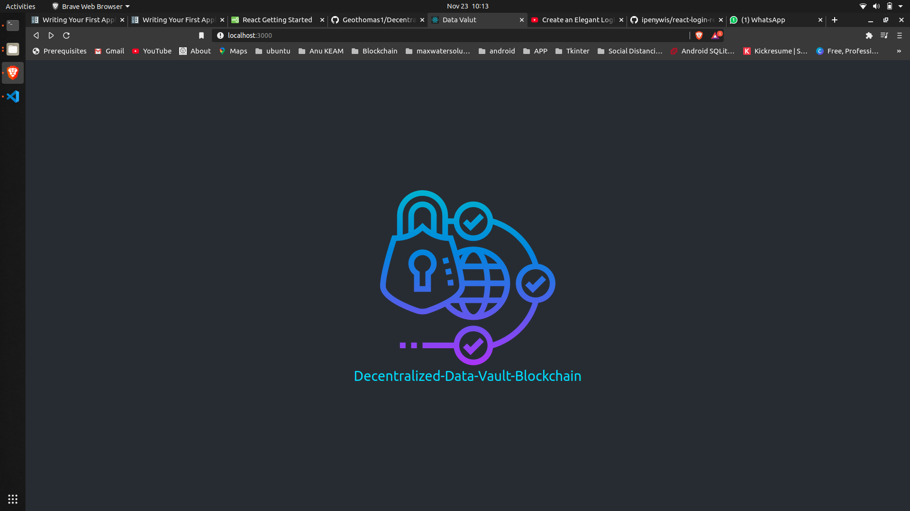
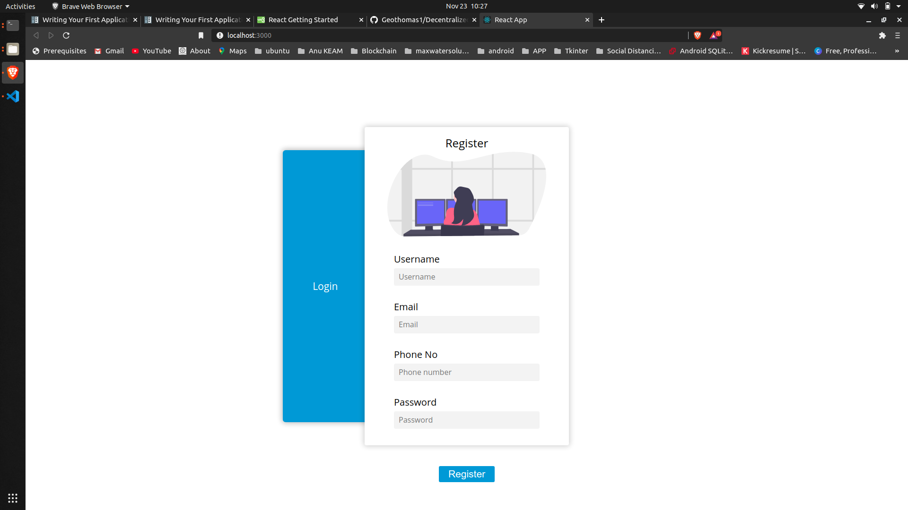
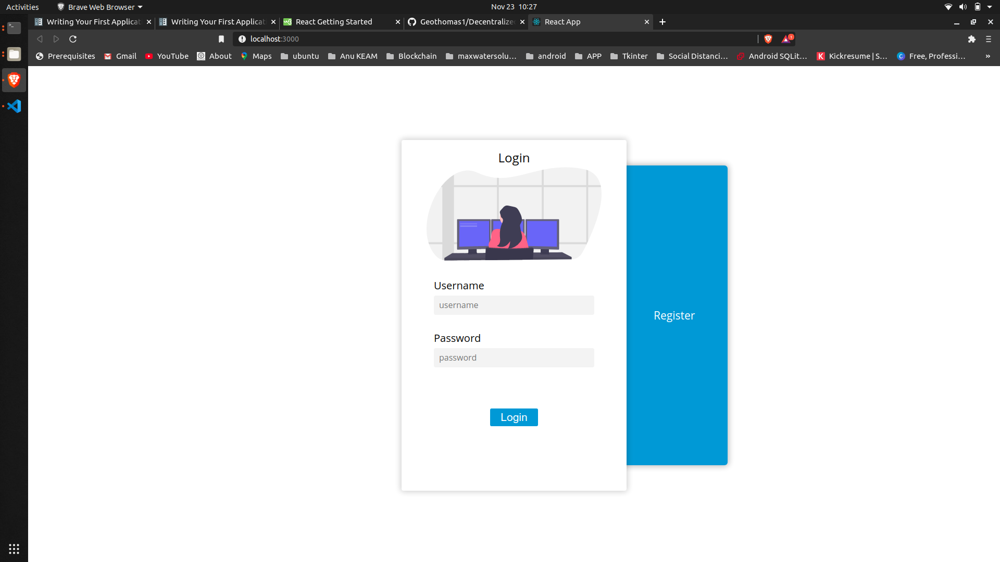
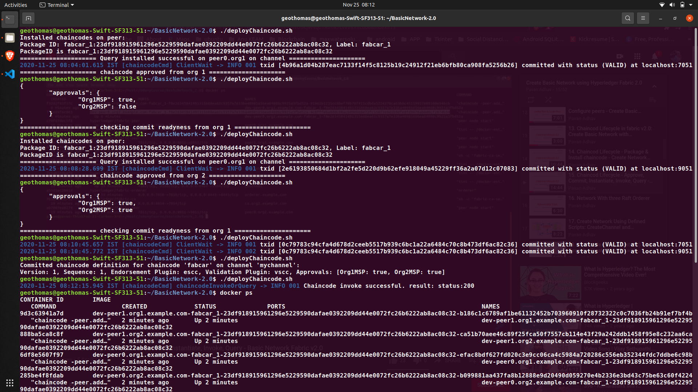
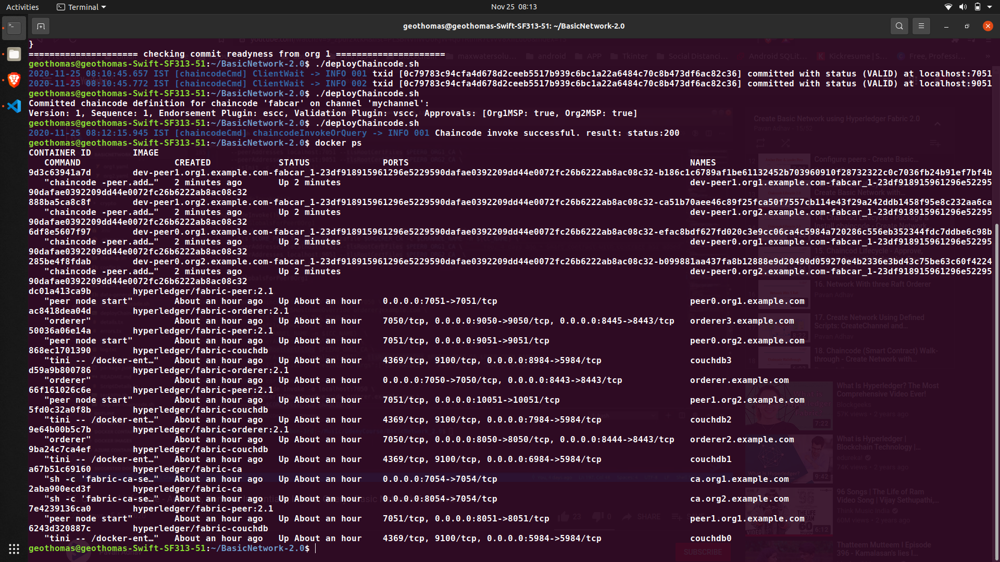
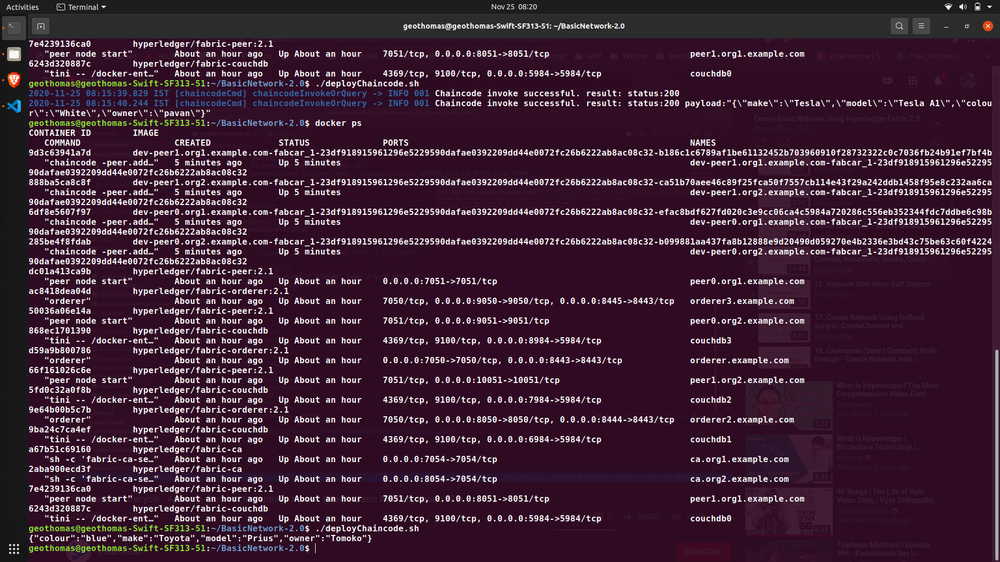
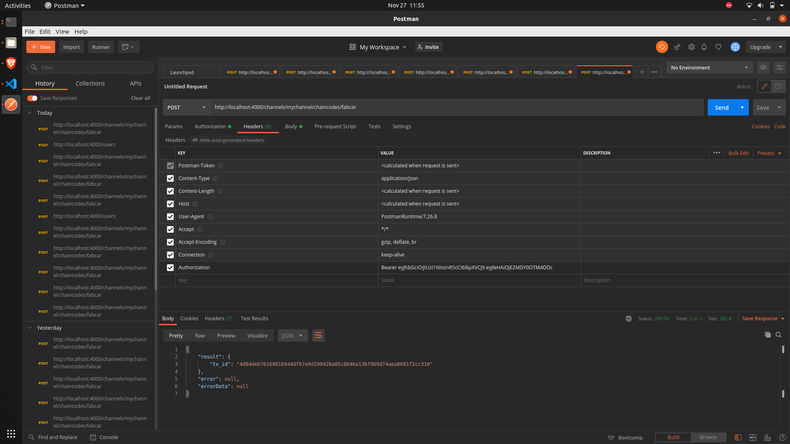
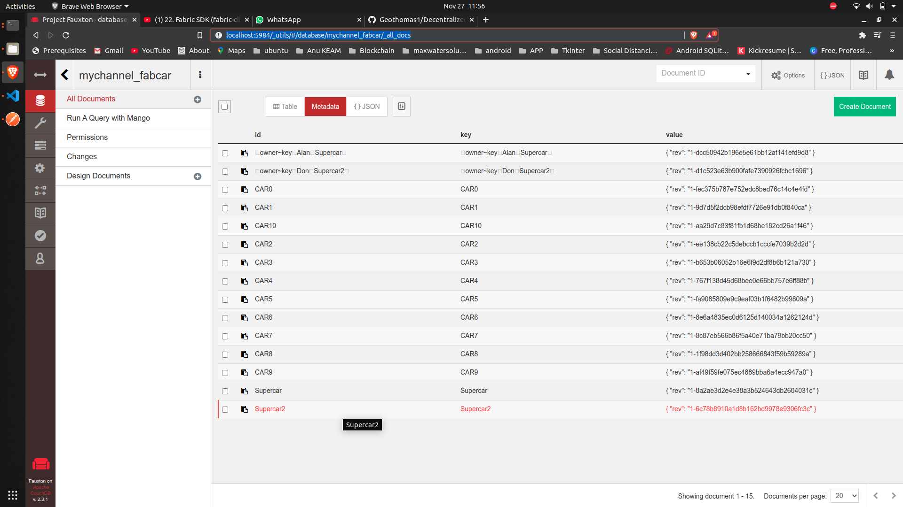

# Getting Started with Decentralized-Data-Vault-Blockchain
This  Hyperledger Fabric Blockchain network manage data for different service Requests

## Available Scripts

In the project directory, you can run:

### `npm start`

Runs the app in the development mode.\
Open [http://localhost:3000](http://localhost:3000) to view it in the browser.

The page will reload if you make edits.\
You will also see any lint errors in the console.

### `npm test`

Launches the test runner in the interactive watch mode.\
See the section about [running tests](https://facebook.github.io/create-react-app/docs/running-tests) for more information.

### `npm run build`

Builds the app for production to the `build` folder.\
It correctly bundles React in production mode and optimizes the build for the best performance.

The build is minified and the filenames include the hashes.\
Your app is ready to be deployed!

### 'OUTPUT Start'

 
 
### 'login and Register to Network'

 
 

### 'Chaincode DEV'

 
 

 
 

###POSTMAN Request and CouchDB

 
 

###For Restart containers
docker start $(docker ps -aq)

